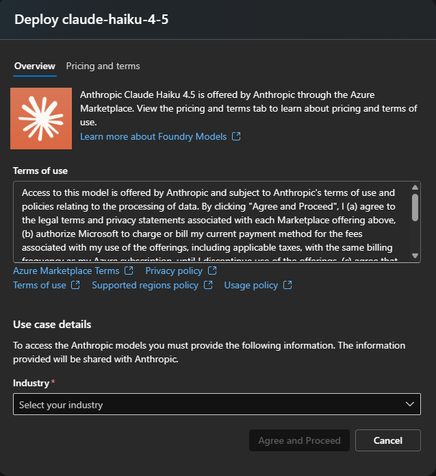

# Deploy Azure AI Foundry models with Terraform

The goal is to deploy all desired models. Not all models are available in every region. The deployment is now simplified to a Cognitive Account, Cognitive Account Project, and Cognitive Deployments. A dedicated resource group is created once in the default region, and accounts/projects are created per model region.  

This project uses the newest (as of 2025-12-04) AzureRM provider `4.55.0`, which adds support for `azurerm_cognitive_account_project` resources. Terraform, Azure CLI, and access to the target subscription are required.

  

Result (here: region East US 2):  


## Anthropic

Anthropic models (Haiku, Sonnet, Opus) are not deployable end-to-end by default. Azure prompts for an "Industry" question when deploying one of these models, which currently must be answered manually in the Azure AI Foundry UI. After completing that manual deployment (and deleting the temporary model), Terraform deployments for Anthropic models succeed.

  

Recommended workflow:
- Comment out the Anthropic models in `terraform.tfvars`.
- Deploy the project.
- Deploy one Anthropic model manually in the UI and answer the industry prompt.
- Delete the temporary manual model (after deployment shows up as succeeded).
- Uncomment the Anthropic models in `terraform.tfvars`.
- Deploy the project again.


## What gets created
- Resource group in the default region.
- Cognitive Account (`AIServices`) per model region, with project management enabled.
- Cognitive Account Project per Cognitive Account.
- Cognitive Deployment per model defined in `terraform.tfvars`, depending on the project.

## Configure and deploy

### Login
```bash
az login

# Login with a specific tenant ID
az login --tenant {tenant}

# Set the active subscription
az account set --subscription "{subscription}"
```

### Create Service Principal and write to file
```bash
# Create a service principal with the Owner role
az ad sp create-for-rbac --role="Owner" --scopes="/subscriptions/{subscription}" --sdk-auth > azure_credentials.json

# Alternatively, create a service principal with the Contributor role
az ad sp create-for-rbac --role="Contributor" --scopes="/subscriptions/{subscription}" --sdk-auth > azure_credentials.json
```

### Initialize Terraform and remote state (if applicable)
```bash
terraform init -backend-config="config.azurerm.tfbackend" -upgrade
```
- State is stored in a central/global (non-RG-specific) Azure Storage Account configured in `config.azurerm.tfbackend`. Adjust that file to match your shared Storage Account and container.
- For simple local state, remove the `-backend-config="config.azurerm.tfbackend"` flag and re-run `terraform init` (optionally after `rm -rf .terraform`) so state stays in the workspace.

### Configure variables
Set model definitions, regions, and names in `terraform.tfvars` before planning/applying.

### Plan and apply
```bash
terraform plan
terraform apply -auto-approve
```

### Get the Cognitive Services endpoints and access keys
```bash
terraform output endpoint
terraform output primary_access_key
```

## Common Terraform commands
```bash
terraform init
terraform init -backend-config="config.azurerm.tfbackend" -upgrade
terraform validate
terraform plan
terraform apply -auto-approve
terraform destroy
terraform show
terraform state list
terraform state
terraform output <output_definition>
```

## Troubleshooting
``` powershell
# get soft deleted cognitive services accounts
az rest --method get --url "https://management.azure.com/subscriptions/a0fe57e5-df87-4e20-875a-9958172c30b1/providers/Microsoft.CognitiveServices/deletedAccounts?api-version=2021-04-30"

# from the cloud console
Get-AzResource -ResourceId /subscriptions/{subscription}/providers/Microsoft.CognitiveServices/deletedAccounts -ApiVersion 2021-04-30

# delete selective instances
az resource delete --ids ...
```

## Models
[Model availability and regions](https://learn.microsoft.com/en-us/azure/ai-foundry/openai/concepts/models?tabs=global-standard%2Cstandard-chat-completions)
