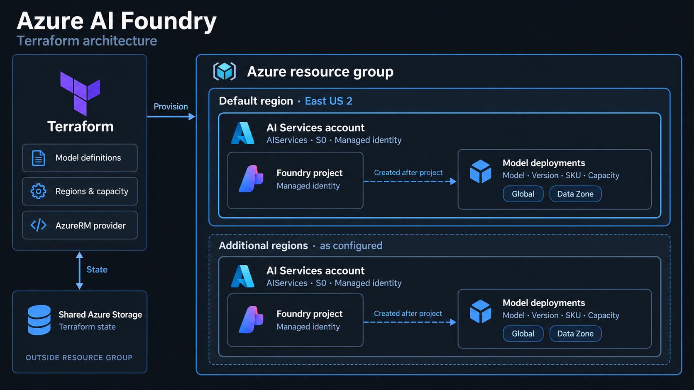
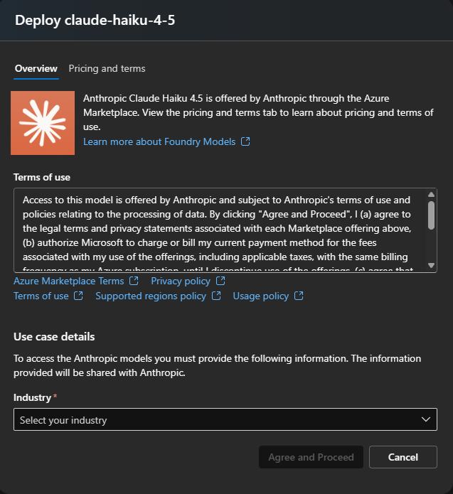

# Azure AI Foundry with Terraform

Deploy chat, coding, image, and audio models to Azure AI Foundry from a single Terraform configuration. Choose each model’s version, region, deployment type, and capacity in `terraform.tfvars`.

Terraform creates one resource group, an AI Services account and Foundry project for each configured region, and the model deployments within those accounts. State lives in a shared Azure Storage backend.



## Deployed models and pricing

**2026-09-26 · 37 deployments · East US 2 + East US · USD per 1M tokens unless stated otherwise.**

Strongest first (approximate). `—` = unavailable/not applicable; MP = megapixel.

### Chat / multipurpose / code (22 models)

#### OpenAI

| Deployed model | Version | Retirement | Input | Output |
| --- | --- | --- | --- | --- |
| `gpt-6-astra` | `2026-09-03` | 2028-01-11 | $10/$20 | $50/$75 |
| `gpt-6-sol` | `2026-09-22` | 2028-03-11 | $2/$4 | $10/$15 |
| `gpt-6-luna` | `2026-09-22` | 2028-03-11 | $0.10/$0.20 | $0.50/$0.75 |
| `gpt-oss-120b` | `1` | 2099-12-31 | $0.15 | $0.60 |

#### Anthropic

| Deployed model | Version | Retirement | Input | Output |
| --- | --- | --- | --- | --- |
| `claude-opus-5-5` | `2` | 2027-09-18 | $4 | $20 |
| `claude-sonnet-5` | `2` | 2027-06-30 | $2 | $10 |
| `claude-haiku-4-5` | `20251001` | 2026-11-15 | $1 | $5 |

#### Z.ai

| Deployed model | Version | Retirement | Input | Output |
| --- | --- | --- | --- | --- |
| `FW-GLM-5.3` | `1` | 2027-09-01 | $2.10 | $6.60 |
| `FW-GLM-5.3-Flash` | `1` | 2027-09-13 | $0.188 | $0.625 |

#### xAI

| Deployed model | Version | Retirement | Input | Output |
| --- | --- | --- | --- | --- |
| `grok-4.6` | `1` | 2027-08-24 | $2/$4 | $6/$12 |
| `grok-4-20-reasoning` | `1` | 2027-04-06 | $1.25 | $2.50 |
| `grok-4-20-non-reasoning` | `1` | 2027-04-06 | $1.25 | $2.50 |

#### Moonshot AI

| Deployed model | Version | Retirement | Input | Output |
| --- | --- | --- | --- | --- |
| `FW-Kimi-K3` | `1` | 2027-07-27 | $3.30 | $16.50 |
| `Kimi-K2.7-Code` | `2026-06-12` | 2026-10-03 | $0.95 | $4 |
| `Kimi-K2.6` | `2026-04-20` | 2027-04-16 | $0.95 | $4 |

#### DeepSeek

| Deployed model | Version | Retirement | Input | Output |
| --- | --- | --- | --- | --- |
| `DeepSeek-V4.1-Flash` | `2026-09-10` | 2026-12-15 | — | — |
| `FW-DeepSeek-V4.1-Flash` | `1` | 2027-09-15 | $0.375 | $1.50 |
| `DeepSeek-V4-Pro` | `2026-04-23` | 2028-02-20 | $1.74 | $3.48 |

#### MiniMax

| Deployed model | Version | Retirement | Input | Output |
| --- | --- | --- | --- | --- |
| `FW-MiniMax-M3` | `1` | 2027-08-01 | $0.33 | $1.32 |

#### Mistral AI

| Deployed model | Version | Retirement | Input | Output |
| --- | --- | --- | --- | --- |
| `mistral-medium-3-5` | `1` | 2027-10-01 | $1.50 | $7.50 |
| `Mistral-Large-3` | `1` | 2099-12-31 | $0.50 | $1.50 |

#### Meta

| Deployed model | Version | Retirement | Input | Output |
| --- | --- | --- | --- | --- |
| `Llama-3.3-70B-Instruct` | `5` | 2099-12-31 | $0.71 | $0.71 |

### Image generation (9 models)

#### OpenAI

| Deployed model | Version | Retirement | Input (Text/Image) | Output |
| --- | --- | --- | --- | --- |
| `gpt-image-2.5-sunburst` | `2026-09-08` | 2027-09-08 | $5/$8 | $30 |
| `gpt-image-2.5-flare` | `2026-09-08` | 2027-09-08 | $5/$8 | $30 |
| `gpt-image-2` | `2026-04-21` | 2027-10-21 | $5/$8 | $30 |
| `gpt-image-1.5` | `2025-12-16` | 2026-12-16 | $5/$8 | $32 |
| `gpt-image-1-mini` | `2025-10-06` | 2027-04-07 | $2/$2.50 | $8 |

#### Microsoft

| Deployed model | Version | Retirement | Input (Text/Image) | Output |
| --- | --- | --- | --- | --- |
| `MAI-Image-2.6` | `2026-07-31` | 2027-01-09 | $5/$8 | $38 |
| `MAI-Image-2.6-Flash` | `2026-07-31` | 2027-01-09 | $1.75/$2.50 | $19 |

#### Black Forest Labs

| Deployed model | Version | Retirement | Input | Output |
| --- | --- | --- | --- | --- |
| `FLUX.2-pro` | `1` | 2099-12-31 | $0.015/MP | $0.03/$0.015 per MP |
| `FLUX.2-flex` | `1` | 2099-12-31 | $0.05/MP | $0.05/$0.05 per MP |


### Audio (6 models)

#### OpenAI

| Deployed model | Version | Retirement | Input (Text/Audio/Image) | Output (Text/Audio) |
| --- | --- | --- | --- | --- |
| `gpt-live-1` | `2026-09-10` | 2027-09-10 | — | $3/hour |
| `gpt-realtime-2.1` | `2026-07-07` | 2027-07-31 | $4/$32/$5 | $24/$64 |
| `gpt-audio-1.5` | `2026-02-23` | 2027-08-24 | $2.50/$32/— | $10/$64 |
| `gpt-realtime-2.1-mini` | `2026-07-07` | 2027-07-31 | $0.60/$10/$0.80 | $2.40/$20 |
| `gpt-transcribe` | `2026-07-28` | 2028-02-01 | — | $0.27/hour |
| `gpt-4o-mini-tts` | `2025-12-15` | 2027-06-15 | $0.60/—/— | —/$12 |

These figures are approximate and may be incomplete; accuracy is not guaranteed.

## Deploy

You need Terraform, Azure CLI, an Azure subscription with model access and quota, and an existing Azure Storage account and container for state. The configuration uses AzureRM `5.7.x` and registers `Microsoft.CognitiveServices` through the provider.

### 1. Set up credentials

Sign in and select the subscription:

```bash
az login
az account set --subscription "<subscription-id>"
```

The provider reads `clientId`, `clientSecret`, `subscriptionId`, and `tenantId` from `azure_credentials.json`. To create a service principal with Contributor access:

```bash
az ad sp create-for-rbac \
  --name "foundry-terraform" \
  --role Contributor \
  --scopes "/subscriptions/<subscription-id>" \
  --json-auth > azure_credentials.json
```

`azure_credentials.json` and the backend configuration are excluded from Git.

### 2. Configure state

For a new checkout, copy the backend template:

```bash
cp config.azurerm.empty.tfbackend config.azurerm.tfbackend
```

Fill in the storage resource group, account, container, access key, and a state-file key unique to this deployment. The storage account is shared infrastructure and is not created by this configuration.

### 3. Choose models and regions

Edit `terraform.tfvars`. Each entry defines a model deployment; for example:

```hcl
{
  name     = "gpt-6-astra"
  model    = "gpt-6-astra"
  version  = "2026-09-03"
  format   = "OpenAI"
  region   = "East US 2"
  sku_name = "GlobalStandard"
  capacity = "100"
}
```

Use the publisher’s exact model name, format, and version. Choose `GlobalStandard` or `DataZoneStandard` where supported, and set capacity within the model’s regional quota. `name` is the unique Terraform entry key; `model` also becomes the Azure deployment name.

`cga_name` controls the account-name prefix. Accounts outside `default_region` receive a region suffix. The resource group name is set in `main.tf`.

### 4. Plan and apply

```bash
terraform init -backend-config="config.azurerm.tfbackend"
terraform validate
terraform plan -out=tfplan
terraform apply tfplan
```

For a first Claude deployment, complete the consent setup below before applying the full model list.

### 5. Retrieve endpoints and keys

Both outputs are maps keyed by region:

```bash
terraform output -json ai_services_endpoint
terraform output -json ai_services_primary_access_key
```

The second command prints the access keys.

## Claude consent

This configuration uses a manual Foundry consent step for Anthropic models. On a new setup:

1. Temporarily omit the Anthropic entries from `terraform.tfvars` and deploy the accounts and projects.
2. Deploy one Claude model in [Microsoft Foundry](https://ai.azure.com/), completing the organization, country, industry, and terms prompts.
3. Once the temporary deployment succeeds, delete it in Foundry.
4. Restore the Anthropic entries, create a new Terraform plan, and apply it.



[handover.md](handover.md) documents the AzureRM `5.7.0` consent limitation checked on 2026-09-25 and a proposed AzAPI implementation. See also [Microsoft’s Claude deployment guide](https://learn.microsoft.com/en-us/azure/developer/ai/how-to/deploy-claude-foundry).

## Update deployments

Change the model entries in `terraform.tfvars`, then run `terraform plan -out=tfplan` and `terraform apply tfplan` again. Review replacements and removals in the plan, especially when changing entry keys, deployment names, or regions.

To inspect the models available to an account:

```bash
az cognitiveservices account list-models \
  --resource-group "<resource-group>" \
  --name "<account-name>" \
  --query "[?contains(name, 'opus')]"
```

Availability depends on the model, version, deployment type, and region. Consult the [model availability documentation](https://learn.microsoft.com/en-us/azure/ai-foundry/openai/concepts/models?tabs=global-standard%2Cstandard-chat-completions) and the account’s quota before adding a deployment. Refresh the inventory above using the instructions in [AGENTS.md](AGENTS.md).

## Troubleshooting

**Account name still reserved after deletion:** list soft-deleted accounts in the selected subscription:

```bash
az cognitiveservices account list-deleted --output table
```

**Use local state:** remove the `backend "azurerm"` block from `provider.tf` before initializing a new local setup. To move an existing deployment’s state, remove that block and run `terraform init -migrate-state`.

**Inspect managed resources:**

```bash
terraform state list
terraform show
```

To remove the infrastructure managed by this configuration, run `terraform destroy`. The shared backend storage remains separate.
